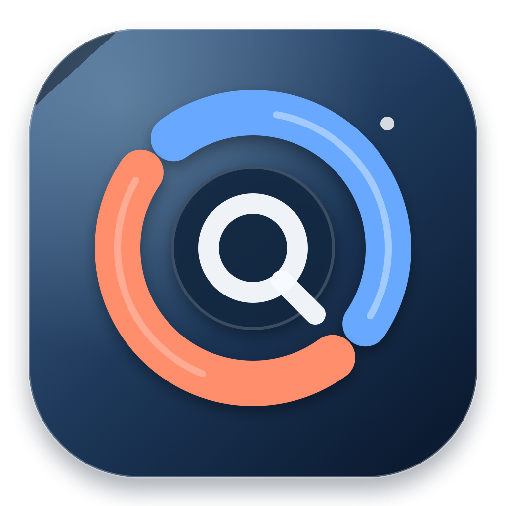

<p align="center">
  
</p>

<h1 align="center">Token Bloom</h1>

<p align="center">macOS 菜单栏中的 Codex 双账号额度查看器</p>

<p align="center">
  
  
  
</p>

Token Bloom 是一个原生 macOS 菜单栏工具，用于同时查看两个 Codex 账号的额度、重置时间和本地使用状态。它直接读取本机登录信息，不经过第三方中转服务器。

## 功能

- 同时显示两个 Codex 账号的 Session 和 Weekly 额度。
- 每 60 秒自动刷新，也可以手动刷新。
- 分别显示两个账号的套餐、剩余额度、重置时间和额度重置次数。
- 正在使用的账号会显示活动状态。
- 支持菜单栏紧凑显示和悬浮窗口详细显示。
- 根据额度状态和本地天气显示动态背景。
- 支持简体中文和英文。
- 支持登录 macOS 后自动启动。
- 不包含 Claude 或其他 AI 服务。

## 两个账号

默认使用以下两个 Codex 配置目录：

```text
~/.codex
~/.codex-2
```

第一个账号通常已经存在。登录第二个账号：

```bash
mkdir -p ~/.codex-2
CODEX_HOME=~/.codex-2 codex login
```

如果 `codex` 不在终端 PATH 中，可以使用 Codex CLI 的完整路径执行登录。

Token Bloom 只读取两个目录中的 `auth.json`，不会自动续期、修改或上传 Token。账号目录也可以在 Token Bloom 的设置中重新选择。

## 安装

目前仓库提供源码构建方式。系统要求：

- macOS 14 Sonoma 或更高版本。
- Xcode Command Line Tools。
- Swift 6。

克隆并运行：

```bash
git clone https://github.com/MeowkingCP/QuotaDot.git
cd QuotaDot
TOKENBLOOM_ALLOW_ADHOC=1 ./script/build_and_run.sh
```

这是本地开发构建，使用临时签名。公开分发前，应使用 Developer ID 对应用签名并完成 Apple 公证。

## 开发检查

```bash
swift build
swift test
./script/security_check.sh
TOKENBLOOM_ALLOW_ADHOC=1 ./script/build_and_run.sh --verify
```

项目结构：

```text
Sources/TokenBloom/       应用源码
Tests/TokenBloomTests/    测试
script/                   构建、打包和安全检查脚本
docs/                     安装与发布说明
```

## 隐私与安全

- Codex 凭据只从本机的两个 `CODEX_HOME/auth.json` 读取。
- Token Bloom 不保存、不上传、不修改访问 Token。
- 额度请求直接发送到 OpenAI 官方接口。
- 天气功能只在获得定位权限后使用设备位置请求天气服务。
- 项目不会收集分析数据，也没有自己的账号系统或额度中转服务。

更多信息见 [PRIVACY.md](PRIVACY.md) 和 [SECURITY.md](SECURITY.md)。

## 许可证

[MIT License](LICENSE) © 2026 Token Bloom Contributors
